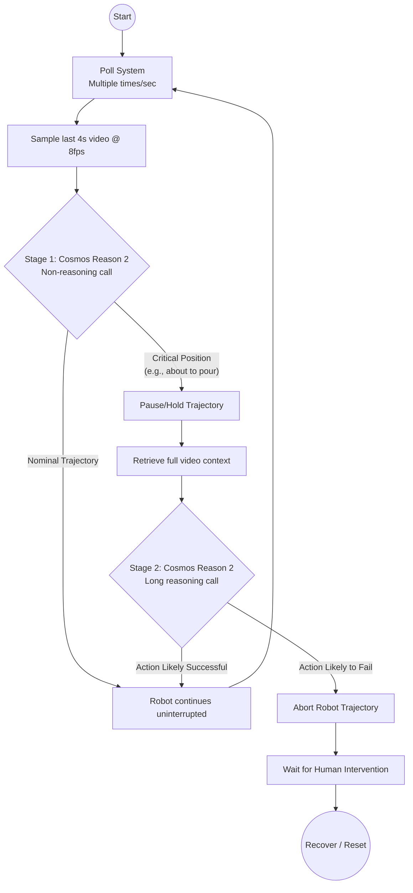
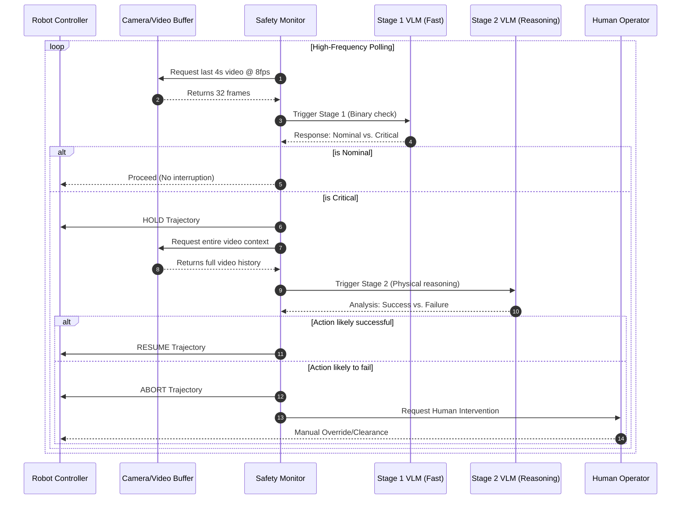

# Cosmos Safety
## Motivation

Our goal is to create robust robotic systems that can automate liquid pouring in wet labs.

- Robotic labs and lab-in-the-loop AI will be the future of biology, and integrating models that reason about potential failures before they happen will ensure productivity gains don't sacrifice safety.
- We built Cosmos Safety as the **real-time safety layer** for future robotic wet labs.

## Implementation

- We train a 80M parameter ACT model running locally with LeRobot SO-101 arms to be the brain of the robot.  
- We integrate Cosmos Reason to reason real time about trajectories on short time frames and determines whether the pouring trajectory will be successful. An unviable trajectory will be paused before the pouring commences.
- Specifically, every 32 frames will be sent to Cosmos Reason to trigger a ~0.1 second output whether the robot is pouring; if it is, the robot will pause and send a prompt to trigger a ~10 second reasoning response as for whether the robotic arm is on track for pouring. 
- Pausing is enabled via the CosmosSafetyMonitor class in `cosmos_safety.py`, which is hooked into the robot client in the lerobot module within `lerobot_record.py`. 

### Decision Flow



### Component Interaction


## Installation

First, clone this repo and initialize the lerobot submodule. Then, create a virtual environment and install the lerobot submodule:

```bash
# Using pip
pip install -e "./lerobot[feetech]"

# Using uv
uv pip install -e "./lerobot[feetech]"
```

After installing dependencies, proceed to run Cosmos Safety.

## Usage

> [!IMPORTANT]
> Ensure you run all commands from the Cosmos Safety project root.

### Cosmos Safety Monitor

When running `lerobot-record` with a policy, enable the Cosmos safety monitor with `--cosmos_safety.enabled=True`. This will:

1. **Binary check** (1 token, ~1 sec interval): Detect if the robot is about to pour water
2. **Pause**: When detected, the robot holds its current position
3. **Full reasoning**: Cosmos Reason analyzes the trajectory to determine if it is on track
4. **Resume/Abort**: If the trajectory is viable, the robot resumes; otherwise it remains paused

Example:
```bash
lerobot-record --robot.type=so101_follower ... --policy.path=your/policy --cosmos_safety.enabled=True
```

### Remote Cosmos VLM (cloud inference)

To run Cosmos on a cloud server while LeRobot runs locally:

**On cloud:**
```bash
cd cosmos && python -m uvicorn reason_server:app --host 0.0.0.0 --port 8000
```

**On local** (with SSH tunnel):
```bash
ssh -L 8000:localhost:8000 user@cloud-ip   # separate terminal
export COSMOS_REMOTE_URL=http://127.0.0.1:8000
# then run lerobot-record with --cosmos_safety.enabled=True
```

Without tunnel (cloud has public IP): `export COSMOS_REMOTE_URL=http://<cloud-ip>:8000`

## Evals

We evaluate the success of our integration of Cosmos Reason with the pretrained ACT by measuring the accuracy and precision of the system when presented with 20 safe/unsafe pouring positions. 
- **Sensitivity** (continue when safe): 7/10
- **Specificity** (stop when unsafe): 8/10

## Future Steps
- Reset robot to a safe position after Cosmos Safety triggers rather than just continuing to pause. 
- Add human in the loop support for intervention on pause.
- Develop online RL training integration leveraging Cosmos Safety.


## Models and Datasets Used

[Training Dataset](https://huggingface.co/datasets/Sophon96/eval_pour-milk)

[Trained ACT](https://huggingface.co/Sophon96/pour-milk-policy)

[Nvidia Cosmos Reason 2](https://huggingface.co/nvidia/Cosmos-Reason2-8B)
